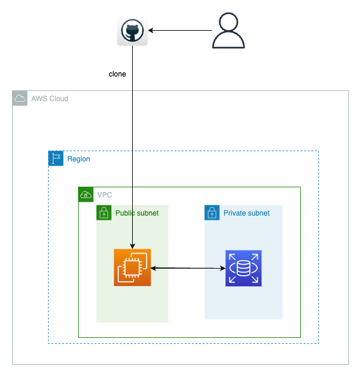

# 第15回課題（Javaコース）
  
## 課題: JavaアプリをEC2上にデプロイ  
  
 - 構成図  
   
   

###  行なったこと  
 - AWSの環境構築
 - インスタンスにGit, Java, MySQLのインストール
 - リポジトリをクローン  
 - アプリの起動と動作確認  
  
###  AWSの環境構築  
  
 1. VPCの構築  
    東京リージョンにてVPCを作成。  
    セキュリティーグループも新規で作成。  
  
  
 2. EC2の構築  
    1で構築したVPC内にEC2インスタンスを構築。
    サーバーはAmazonLinux2。    
    Railsアプリのデプロイ時にt2.microを選択したが、Rubyのインストールが全く進まない事態が発生したので、その教訓としてt2.smallを選択。  
    こちらにもセキュリティーグループを付与。  
    Elastic IPも設定することで固定IPを利用可能にした。
  
  
 3. RDSの構築  
    RDSインスタンスを作成し、EC2と接続。  
  
### インスタンスに必要なものをインストール
  
- EC2 

    yumをアップデートし、gitとjavaをインストール  

    ```
    sudo yum update
    
    sudo yum install git
    
    sudo yum install java  

    ```
  
- RDS  
  
  デフォルトで入っているMariaDBの削除とMySQLのインストールを行う  
  
  ```
    #MariaDB関連のものを全て削除
    sudo yum remove mariadb-*
    
    sudo yum install mysql
    
    #必要なパッケージも念の為インストール
    sudo yum install --enablerepo=mysql80-community mysql-community-server
    sudo yum install --enablerepo=mysql80-community mysql-community-devel

    ```

    環境ができたらMySQLに接続  
      
    ```
    mysql -h RDSのエンドポイント -P 3306 -u ユーザーネーム -p
    ```  
      
    パスワードを入力してログインを確認　　
  

### Gitでリポジトリをクローンしてアプリを起動　　
  
デプロイするアプリをクローンしたら、application.propatiesに必要な項目を記入する。 
VSCodeからもSSHでインスタンスに接続し、そのままそこから編集を行なった。  
   
  ```
  #リポジトリからクローン
  git clone ~~~~
    
  ```
  
  ```
  #application.propaties
    
  spring.datasource.url=jdbc:mysql://RDSのエンドポイント:3306/DB名
  spring.datasource.username=ユーザー名
  spring.datasource.password=パスワード
  #MySQLと接続するためのドライバーを設定
  spring.datasource.driver-class-name=com.mysql.cj.jdbc.Driver
  #起動できなかった時のデバッグ用
  logging.level.root=DEBUG    
  ```