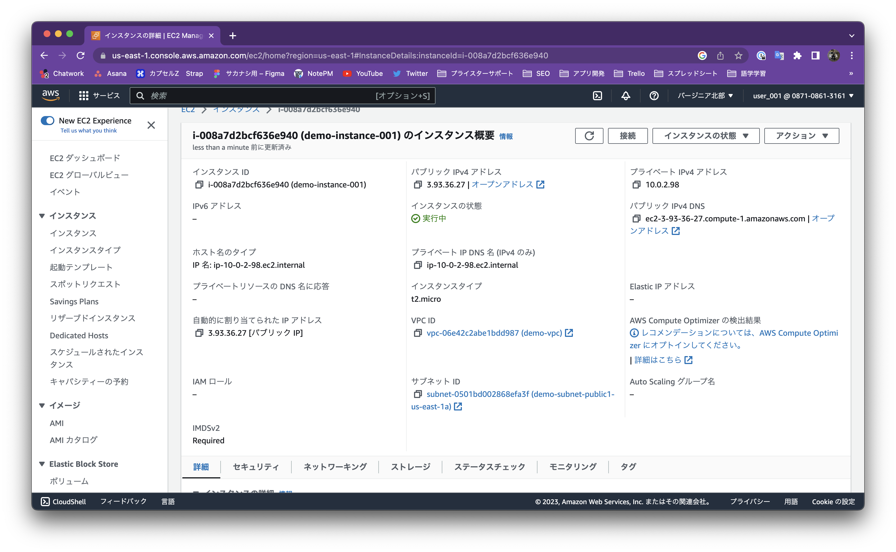

# 第4回課題

## 行なったこと
- VPCの構築
- EC2インスタンスの作成
- RDSインスタンスの作成
- SSHでEC2インスタンスに接続
- EC2にMySQLをインストール
- EC2からRDSに接続git 

## VPCの構築

  

## EC2インスタンスの作成

## RDSインスタンスの作成

## SSHでEC2インスタンスに接続

SSH接続時にタイムアウトエラーにより接続拒否の事象が発生。  

→セキュリティグループのインバウンドルールでSSH接続時のIPアドレスの許可を追加  

## EC2にMySQLをインストール
MySQLにログインしようとしたところ、コマンドがないとのこと。  
インスタンス内にMySQLがインストールされていないため、yum経由でインストール。  
また、SSH接続時と同様にタイムアウトエラーの接続拒否が発生したため、許可を追加（上記画像に記載）  

