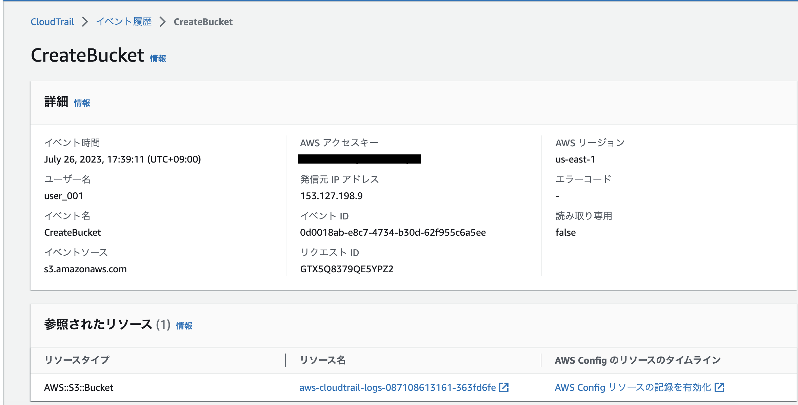
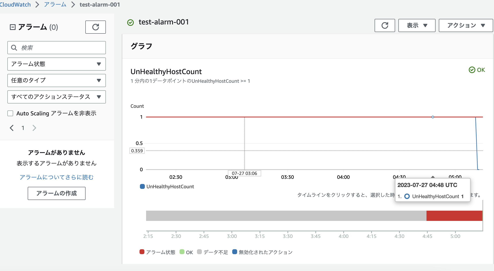
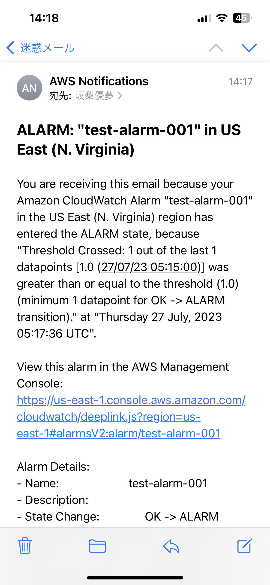
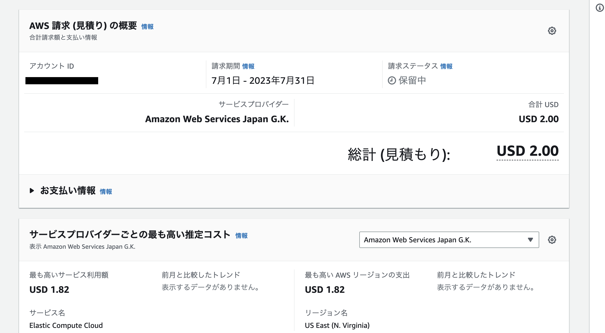
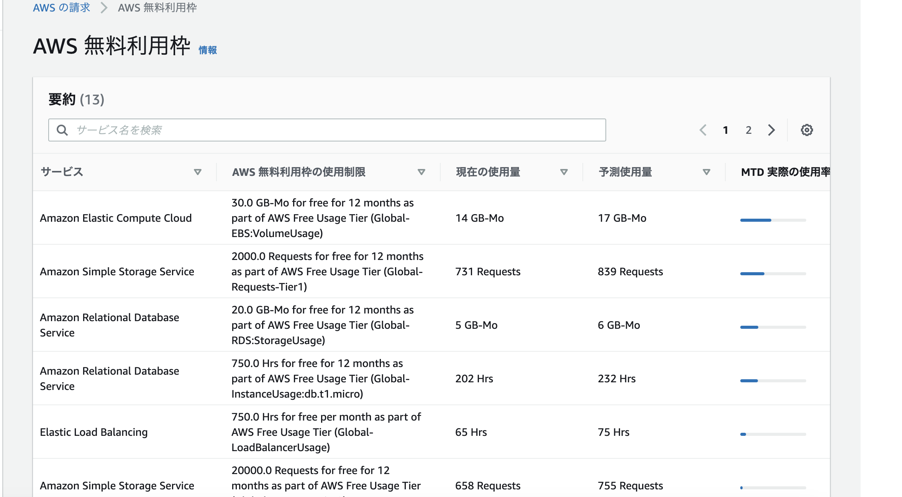
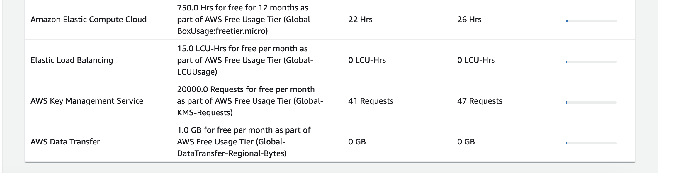

# 第6回課題

## イベントの確認
  
    

### イベント名: CreateBucket

- ユーザー名  
  
- 発信元IP  
  
- イベントID  
  
***  
  
## CloudWatchでアラーム通知の設定

 - CloudWatch上でアラートを設定  
    EC2のヘルスチェックが失敗している場合にカウントするメトリクスを利用  
  
 - 動作確認としてNginxサーバーを停止し、502を発生させるとメールが送られてくるかを確認  
   
 - 正常に動作している場合はアラート状態は解消されていることを確認
  
  
  
メール通知  
  
  
***
  
## 利用料の見積もり  
  
- 現在までの利用料  
  
見積もり
→ https://calculator.aws/#/estimate  
  

  
  
- 無料利用枠  
  
  
  
  
