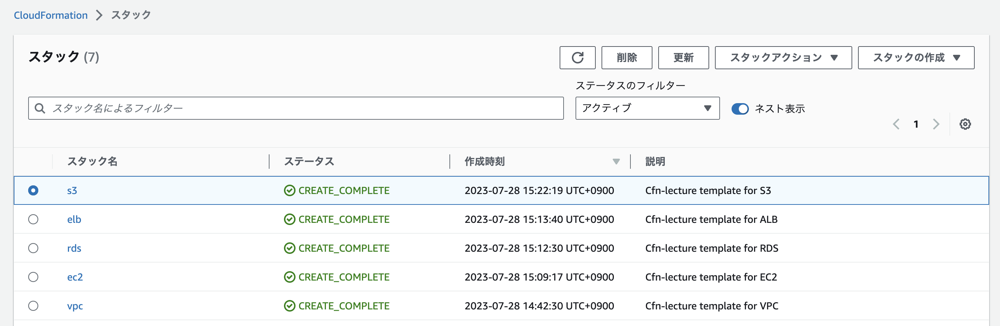
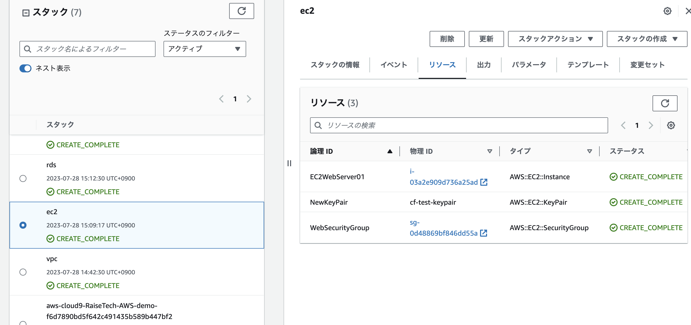
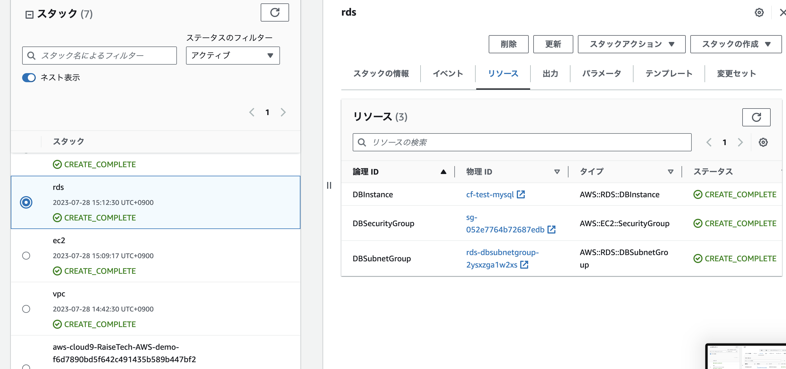
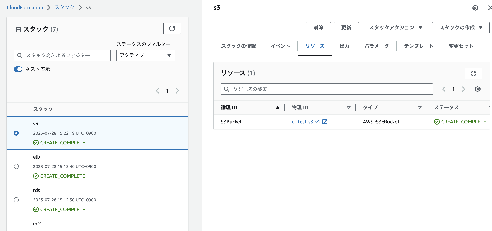
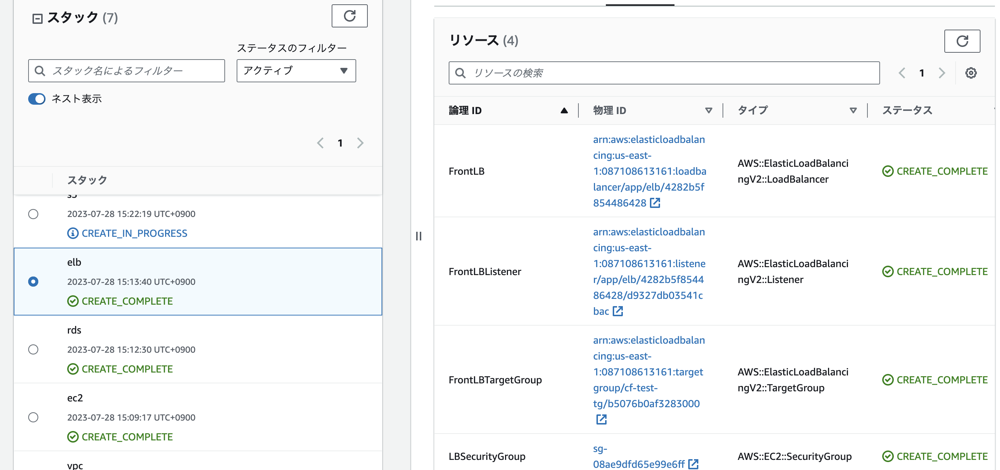

# 第10回課題

## 行なったこと　　
  
- それぞれの環境をコード化し、CloudFomationにて自動構築されるようにすること  
- 環境を設定するymlファイルを作成し、CloudFomationにアップ、必要項目を入力 
  
***
  
### 作成したスタック　　
  
VPC、EC2、RDS、S3、ELBを分けてコード化  

   
  
### VPC
  
  
  
### EC2
  
  
  
### RDS
  
  
  
### S3
  
  
  
### ELB
  
  
  

 