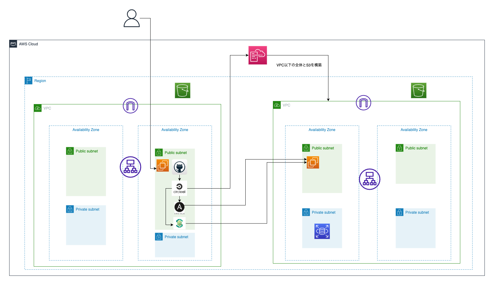
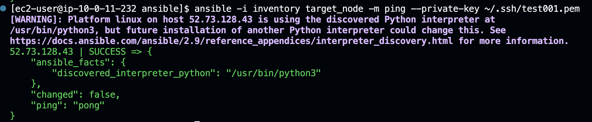
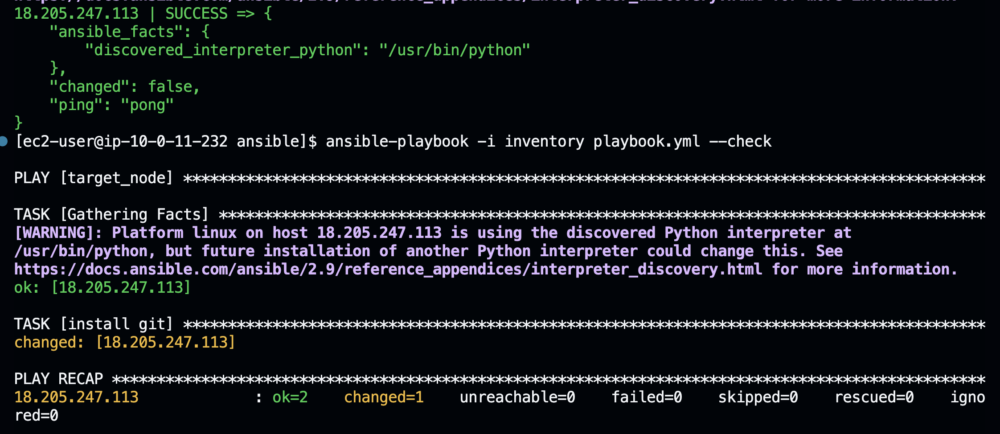
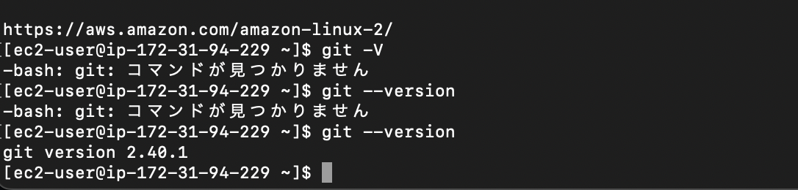
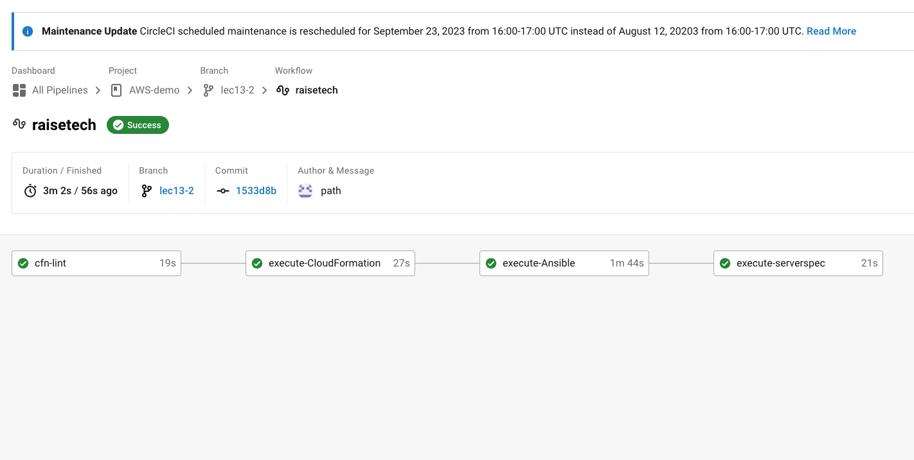
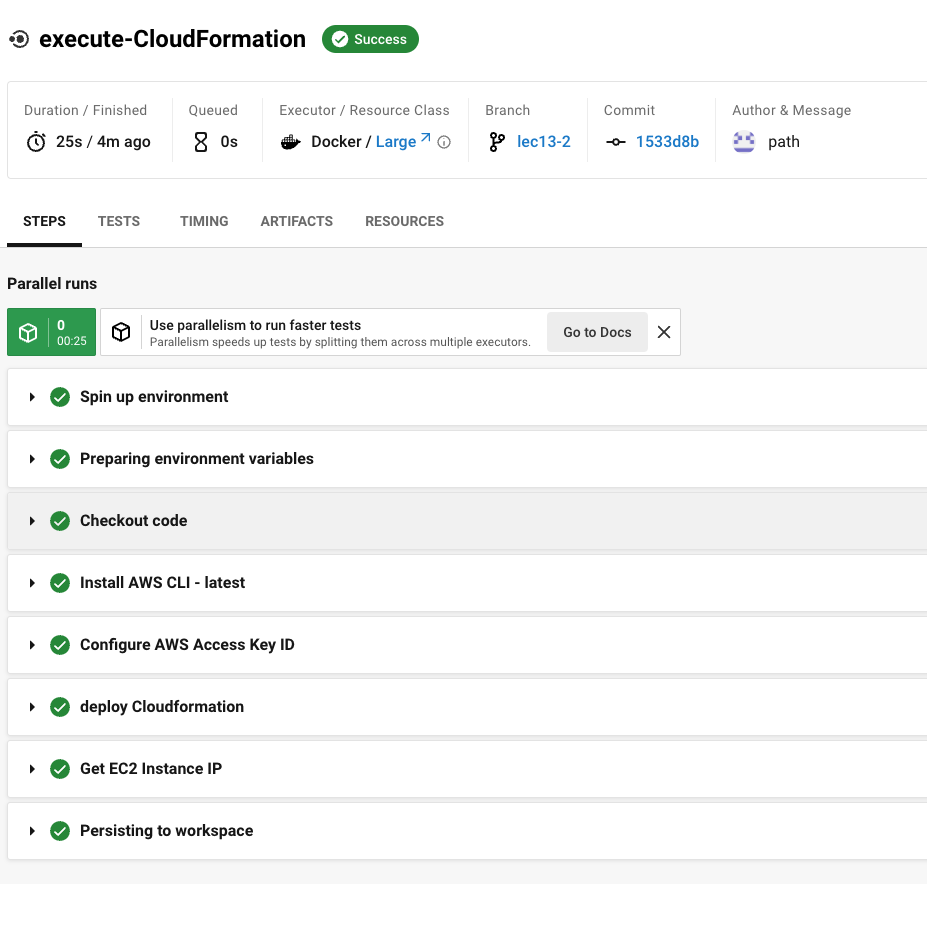
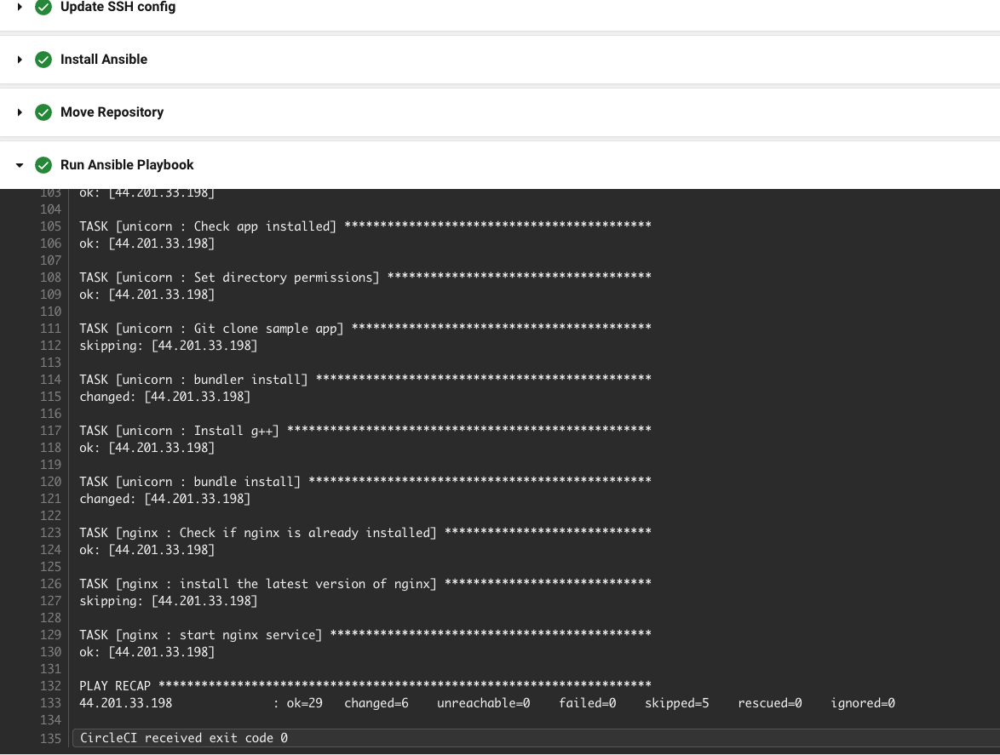
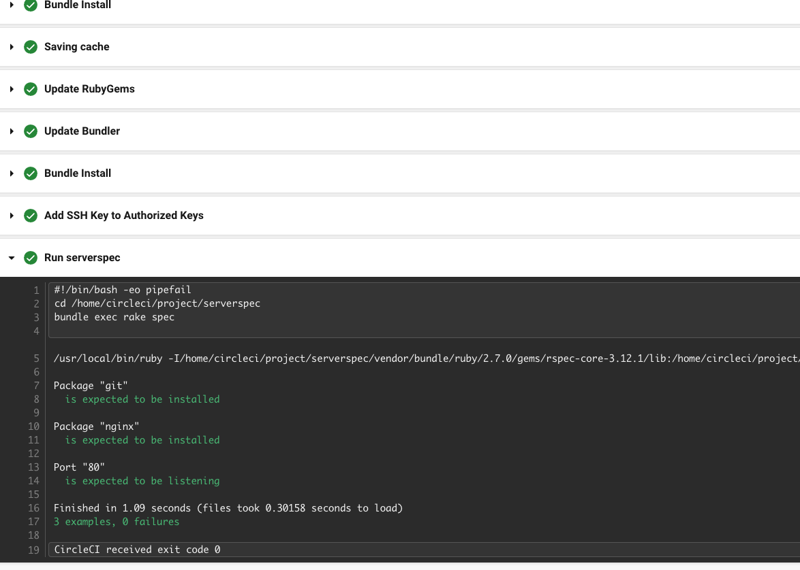

# 第13回課題　　

## 行なったこと  
  
### CircleCIによる環境構築の自動化
- CircleCI上にCloudFormationとAnsibleとServerSpecの導入
- EC2上にAnsbleの構築
- ターゲットノードをCloudFormationで立てたEC2に設定
- ターゲットノードに対して環境構築、ServerSpecでのテスト
  
## 構成図  
  
  
  
## 手順　　
　　
1. コントロールノードのEC2上にAnsibleの構築
  
    ```
        sudo yum install -y ansible
    ```  
    
    その中にinventry、playbook.yml、ansible.cfgを作成  
    テストで別のEC2に対して接続およびドライラン  
    
      
      
     
       
    接続とgitのインストールを確認  
      
    加えて、gitのリポジトリをコントロールノード上にクローン。  
    httpでクローンしてきたが、結局プッシュする際にSSH接続でないとできないため、ローカルで認証のキーペアを作成しGitHubに登録。　　
    プッシュの際のSSHキー認証のためのパスフレーズも設定したので、pushコマンド時にパスワードの入力が必要。  
   
2. CircleCI上にCloudFormationの導入  
      
    上記構成図の通り、VPC以下の環境をCloudFormationで構築。  
    ここで新規作成したEC2をターゲットノードに設定したいため、作成されたパブリックIPを取得する下記のタスクを追加。  
      
    ```
        - run:
            name: Get EC2 Instance IP
            command: |
                #awscliでIPを取得するコマンド
                export EC2_IP=$(aws cloudformation describe-stacks --stack-name ec2 --query 'Stacks[0].Outputs[?OutputKey==`EC2InstanceIP`].OutputValue' --output text)
                #次のAnsible実行ジョブに値を受け渡す
                echo $EC2_IP > ec2_ip.txt
                #IP取得の確認用
                echo "EC2_IP: $EC2_IP"
        - persist_to_workspace:
            root: .
            paths:
                - ec2_ip.txt
    ```  
      
    ここでジョブ間で値が受け渡されないことがわかった。  
    今回はworkspaceを用いて、変数を一旦ファイルに格納して使うところでアタッチする手法で解決。  
      

3. Ansible実行ジョブ   
  
    ```
        - attach_workspace:
            at: /tmp/workspace
        - run:
            name: Use EC2 Instance IP
            command: |
                EC2_IP=$(cat /tmp/workspace/ec2_ip.txt) 
                echo "EC2_IP: $EC2_IP"
    ```  
      
    上記タスクでworkspaceをアタッチし、値が受け渡されているかを確認。  
      
    ```
      - run:
          name: Run Ansible Playbook
          command: |
            cd /home/ec2-user/project
            EC2_IP=$(cat /tmp/workspace/ec2_ip.txt)
            echo "ec2_ip: $EC2_IP"
            chmod 600 キーの場所
            ansible-playbook /home/ec2-user/project/ansible/playbook.yml --inventory "$EC2_IP," --extra-vars "ec2_ip=$EC2_IP" -u ec2-user --private-key ~~~
          environment:
            EC2_IP: $EC2_IP
    ```  
      
    さらにAnisbleのターゲットに設置するため、取得したIPを変数に格納してその変数をplaybookに直接渡す。  
    playbook側では、  
    ``` - hosts: "{{ ec2_ip }}" ```
    という形で変数で持っておくことで代入が可能となった。    
    (最初はinventoryで設定しようとしたが、ymlの変数展開がよくわからなかったのでinventoryを使わなかった)   
　　   

    playbook実行ではrubyのインストールがバージョンを指定しても古いもの（2.1くらい）がインストールされてしまう事象が発生。  
    今いるディレクトリを出力しながら原因を探り、よくみるとcheckout先のディレクトリが/home/circleci/project/だったことが判明。  
    .rbenvの中身を見てみると/home/ec2-user/~に対して環境変数が設定してあったため、rubyのインストールのための環境が見つからなかった。  
    (この辺に関してはまだ理解が曖昧なので、引き続き学習を進めます。)  
        
    ということで、少し無理やりな方法ではあるが、/home/ec2-user/を作成してクローンした後に/home/circleci/project/配下を移動させることで環境変数が反映されるようにした。  
     
    ```
        - run:
                name: Move Repository
                command: |
                    sudo mkdir /home/ec2-user/
                    sudo chmod -R 755 /home/ec2-user/
                    sudo mv /home/circleci/project/ /home/ec2-user/
    ```  
    これで無事に最新バージョンのrubyがインストールできた。  
    
    ```
        TASK [ruby : Show Ruby version] ************************************************
            ok: [44.201.33.198] => {
            "ruby_version_output.stdout_lines": [
                "ruby 3.1.2p20 (2022-04-12 revision 4491bb740a) [x86_64-linux]"
                ]
            }
    ```
    
  また、bundleのインストールについても、依存関係が読み込まれておらずインストールできないとのエラーが発生。  
  調べてみると依存しているsassというgemのインストール時にg++コマンドがなくてエラーになっているとのことだったので、下記タスクを追加。  
  (この辺に関しても深く理解できていないので、引き続き学習を進めます。) 

    ```
        - name: Install g++
            become: yes
            become_method: sudo
            yum:
                name: gcc-c++
                state: present
    ``` 　
    
  これでようやくplaybookが全て成功。  
    

4. ServerSpec実行ジョブ  
       
    実行の際にSSH接続ができないため結果が得られないとのエラーが発生。   
    秘密鍵のパスにキーを追加することで解決。  
       
    ```
        - run:
            name: Add SSH Key to Authorized Keys
            command: |
                sudo chmod 600 キーのパス
                cd ~/.ssh
                ssh-add 追加するキー
    ```  

    これによってServerSpecのテストに成功。
    テスト項目は一旦簡易的にgitとNginxのインストール、ポート番号80が開いているかどうかを確認。  
          
    
## 実行結果  
  
CircleCI
  
  
CloudFormation
  
  
Ansible
  
  
ServerSpec
  
  
  
## 感想  
  
とにかく苦しんだポイントが多く、とても時間がかかったが色々な知識が身についた気がする。 
また、かなり妥協した点が多いので、細かいところをもう少し学習した上でちゃんと構築できるようになりたい。  
キーの置き場所やServerSpecのテストなどはまだ詰められると思うので、今後学習しながら応用を効かせていきたい。  


